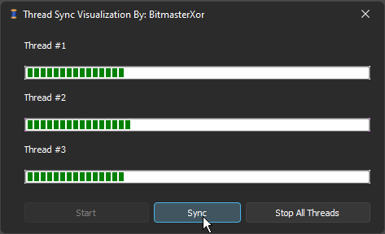

🔄 Delphi Thread Synchronization Visualizer
A sophisticated Delphi VCL application demonstrating real-time thread synchronization with visual progress tracking. This project provides a clear and interactive visualization of thread states, synchronization points, and parallel execution patterns using color-coded progress bars.

  

🛠️ Features

🎯 Visual Thread Management:

Real-time progress visualization
Color-coded thread states
Interactive synchronization control

🔄 Synchronization Points:

Multiple checkpoint barriers (25%, 50%, 75%)
Event-based thread coordination
Visual state indication

📊 Progress Monitoring:

Individual thread progress tracking
Color-coded state feedback
Dynamic speed simulation

📦 Dependencies

JEDI Visual Components (Required)

Used for enhanced progress bars
Components needed:

TJvXPProgressBar

Standard VCL Components

Built-in Delphi components
System thread support
Synchronization objects

🔧 Installation

📥 Install Dependencies:

Install JEDI Visual Components (JVCL)
Ensure VCL components are installed

🖥️ Project Setup:

Clone the repository
Open the project in Delphi
Compile and run

⚙️ Usage

🚀 Start Simulation:

Click the Start button to begin thread execution
Watch as threads progress independently

🔄 Synchronization:

Use Sync button at checkpoints
Observe color changes indicating states:

Green: Active processing
Yellow: Waiting at checkpoint
Lime: Just synchronized

🛑 Stop Execution:

Click Stop to terminate all threads
Progress bars turn red to indicate stopped state

🔒 Technical Implementation

💻 Event-based thread synchronization
🎨 Visual state management
📊 Thread-safe progress updates
🧹 Proper resource cleanup
🔄 Automatic thread termination

🤝 Contributing
Contributions are welcome! Feel free to fork, improve, and submit pull requests.
📜 License
This project is provided "as is" without warranty. Use at your own risk.
📧 Contact
Discord: BitmasterXor

Made with ❤️ by BitmasterXor using Delphi RAD Studio

